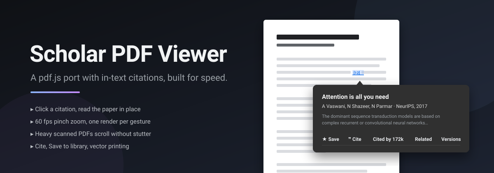

<p align="center">
  
</p>

<p align="center">
  <a href="https://github.com/GhalebAldoboni/scholar-pdf-viewer/releases/latest"></a>
  
  
  
  
</p>

<br>

**Scholar PDF Viewer** replaces Chrome's built-in PDF viewer with a port of pdf.js made for reading papers. Click any citation in the text and the referenced paper opens right there, looked up on Google Scholar: abstract snippet, *Cited by*, *Cite*, *Save to library*. Underneath, rendering is scheduled around what you are doing, so it stays quick and light on documents that make Chrome's viewer and the Scholar reader stutter.

<br>

## Why not the others?

| | Chrome PDF viewer | Google Scholar PDF Reader | **Scholar PDF Viewer** |
|---|:---:|:---:|:---:|
| In-text citation popups | – | ✓ | ✓ |
| Cite / Save to Scholar library | – | ✓ | ✓ |
| Renders with one engine (no second viewer running) | ✓ | – | ✓ |
| 60 fps pinch zoom, one render per gesture | – | – | ✓ |
| Sharp at 300%+ on Retina | – | – | ✓ |
| Smooth on heavy scanned PDFs | – | – | ✓ |
| Vector printing | ✓ | ✓ | ✓ |
| Opens publisher-embedded PDFs (IEEE, Wiley…) | – | ✓ | ✓ |
| Dark theme with readable popup | – | ✓ | ✓ |
| Open source | – | – | ✓ |

<br>

## Features

<table>
<tr>
<td width="50%" valign="top">

### 📎 Citations, in place
Click `[12]` or `(Vaswani et al., 2017)`. The reference is resolved on Google Scholar and shown where you are: title, authors, venue, snippet with *Show more*, links to *Cited by*, *Related*, *Versions* and full text. *See in References* jumps to the bibliography entry.

</td>
<td width="50%" valign="top">

### 📚 Cite and Save
*Cite* opens Scholar's formatted citations (MLA, APA, Chicago) and BibTeX, EndNote, RefMan and RefWorks exports. *Save* files the paper into your Scholar library with labels. Uses your existing Scholar sign-in; nothing is proxied.

</td>
</tr>
<tr>
<td valign="top">

### ⚡ Zoom that keeps up
A pinch is previewed on the compositor and committed to pdf.js once, when your fingers stop. Continuous factor, fixed anchor point, sharp re-render past 2×. Stock pdf.js re-rendered every page on every tick.

</td>
<td valign="top">

### 🏋️ Built for heavy PDFs
No renders start while you fling. Text layers are built in idle frames after the canvas is up. Two pages ahead are pre-rendered so page-down never lands on a blank page.

</td>
</tr>
<tr>
<td valign="top">

### 🌐 Opens everywhere
Direct links, download-style responses, `file://` files, and publisher pages that wrap the PDF in a frame (IEEE Xplore, Wiley, ProQuest, EBSCO). Interception is header-matched with declarativeNetRequest, no request listener.

</td>
<td valign="top">

### 🖨️ Vector printing, dark theme
Printing goes through Chrome's own PDF engine for vector output. Light and dark themes, with a neutral, high-contrast popup palette in dark mode.

</td>
</tr>
</table>

<br>

## Quick start

Download the zip from the [latest release](https://github.com/GhalebAldoboni/scholar-pdf-viewer/releases/latest) and unpack it, or clone:

```bash
git clone https://github.com/GhalebAldoboni/scholar-pdf-viewer.git
```

1. Open `chrome://extensions`, turn on **Developer mode**, click **Load unpacked**, pick the folder.
2. On the extension card, enable **Allow access to file URLs** so local PDFs open here too.
3. Sign in to [Google Scholar](https://scholar.google.com) in Chrome to enable *Save*.

Open any PDF link. Citations turn blue a few seconds after the document loads.

<br>

## Performance

The rule is simple: the main thread does nothing during a gesture, and only pages you will actually look at get rendered.

- **Zoom on the compositor**: CSS transform preview, one pdf.js render per gesture, 61 fps measured on a figure-heavy paper.
- **Continuous pinch**: trackpad deltas map to `exp(-Δy/100)` (Scholar's formula) instead of 10% steps; the point under your fingers stays put.
- **Sharp at high zoom**: canvas cap raised 16 → 48 MP, true Retina resolution to roughly 380%.
- **Idle-frame text layers**: built one per frame after scrolling settles, removing a 100 to 300 ms stall after every zoom or jump.
- **No renders mid-fling**: above 2500 px/s nothing starts; the page you stop on renders first.
- **Background citation analysis**: Scholar's analyzer worker at idle time, about 300 ms once per document.

Every change, with its cause and measurement, is in **[PERFORMANCE.md](PERFORMANCE.md)**.

<br>

## Privacy

No analytics, no beacons, no update pings. The only network traffic the extension itself makes:

| When | Where | What |
|---|---|---|
| You open a citation popup | `scholar.google.com` | The reference text, as a Scholar search, with your Scholar cookies. The first popup also asks Scholar who is signed in so *Save* can work. |
| You click *Cite* or *Save* | `scholar.google.com` | The paper's Scholar id, plus label changes for *Save*. |
| You print a web PDF | the PDF's own server | A 1-byte range request to confirm it is served as a PDF. |

Nothing is sent when you merely read a PDF. Scholar's usage counters are kept locally and never reported; the original viewer's Web Store rating prompt and update URL were removed.

## Under the hood

| Part | Role |
|---|---|
| `worker.js` | Service worker: header-matched PDF interception, `file://` PDFs, embedded publisher frames, context menus. |
| `bg/helper/` | pdf.js 2.7 viewer and engine. |
| `bg/main/scholar-citations.js` | Citation analysis and the reference popup, transplanted from the Google Scholar PDF Reader. Scholar's analyzer worker and sandboxed loader run unchanged; the UI keeps Scholar's identifiers so it diffs against the original bundle. |
| `bg/main/smooth.js` | Compositor zoom, continuous pinch, look-ahead rendering. |
| `bg/main/perf.js` | Render scheduling: idle-frame text layers, fling gating. |
| `bg/main/nativeprint.js` | Vector printing through Chrome's PDF engine. |
| `bg/main/printscript.js` | Content script inside PDF frames: print handshake, embedded-PDF detection. |
| `bg/main/replace.js` | Theme wiring, toolbar additions, URL normalisation. |

<details>
<summary>Repository layout</summary>

```
.
├── manifest.json
├── worker.js                 service worker
├── bg/
│   ├── helper/               pdf.js viewer (web/) and engine (build/)
│   └── main/                 citations, zoom, scheduling, print, theme
├── analyzer_worker_bin.js    Scholar citation analyzer (Web Worker)
├── pdf_loader-compiled.js    Scholar PDF loader (sandboxed iframe)
├── pdf_loader_iframe.html
├── bcmaps/                   CJK CMaps for the loader
├── _locales/
├── icons/
└── assets/
```

</details>

<br>

## Credits

- [pdf.js](https://github.com/mozilla/pdf.js) by Mozilla, Apache License 2.0.
- Citation analysis, reference popup, Cite and library dialogs, native printing and pinch logic from the [Google Scholar PDF Reader](https://chromewebstore.google.com/detail/google-scholar-pdf-reader/dahenjhkoodjbpjheillcadbppiidmhp) by Google LLC, carried over under the Apache License 2.0 headers in its source.
- The viewer shell started from the open-source *PDF Viewer* Chrome extension.

Not affiliated with or endorsed by Google or Mozilla.
